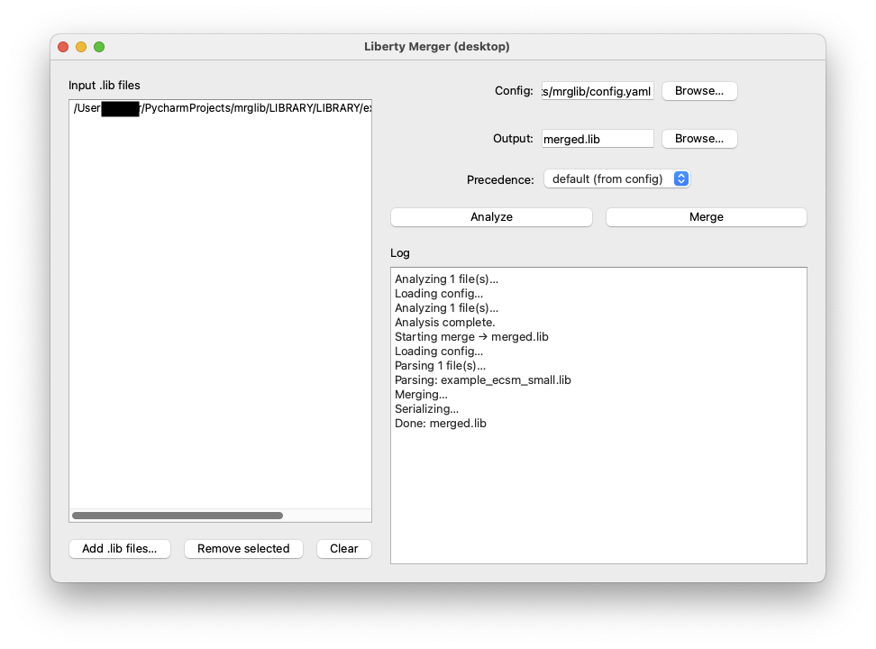

# Liberty Merger (GUI)

**Purpose:** Analyze and merge Liberty (`.lib`) files generated using partitioned characterization technique for QDI logic cells.  

**Status:** GUI is the supported path. 
**CLI is in progress.**

---

## Features
- Parse and analyze `.lib` files (cells, pins, timing/power presence).
- Merge multiple files **or** variants within a single file (e.g., `ACELL1a`, `ACELL1b` → `ACELL1`).
- Preserve inner cell bodies (timing/power groups).
- Export merged output to `merged.lib`.
- Simple JSON/CSV export from the analysis dialog.

---

> Tested on Python **3.11+** (works on 3.13). Requires a virtualenv.

---

## Installation

```bash
git clone https://www.github.com/xiayu87/mrglib
cd mrglib
pip install -r requirements.txt

---


## Run GUI

source .venv/bin/activate
python gui_app.py

---


## Interface

